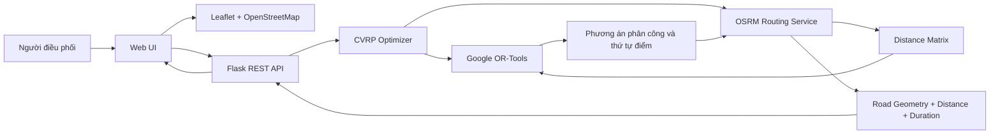

# Hệ thống điều phối phương tiện và tối ưu tuyến giao hàng

Ứng dụng web hỗ trợ phân chia điểm giao cho nhiều phương tiện và xác định thứ tự ghé điểm phù hợp dưới ràng buộc sức chứa. Hệ thống sử dụng Google OR-Tools để giải bài toán CVRP và OSRM/OpenStreetMap để tính khoảng cách, thời gian và hình học tuyến theo mạng đường bộ.

## Mục tiêu

Hệ thống hướng tới bài toán:

- một kho xuất phát;
- nhiều phương tiện có giới hạn sức chứa;
- nhiều điểm giao có vị trí và nhu cầu hàng hóa;
- mỗi điểm giao được phục vụ một lần;
- tải của từng xe không vượt quá sức chứa;
- tổng quãng đường của phương án được giảm tối đa trong phạm vi mô hình.

## Chức năng chính

- Thiết lập vị trí kho.
- Thêm, xóa và cấu hình sức chứa phương tiện.
- Thêm, xóa điểm giao và nhu cầu hàng hóa.
- Chọn kho hoặc thêm điểm giao trực tiếp trên bản đồ.
- Tối ưu CVRP bằng Google OR-Tools.
- Lấy ma trận khoảng cách theo mạng đường bộ từ OSRM.
- Vẽ tuyến thực tế trên Leaflet/OpenStreetMap.
- Đánh số thứ tự các điểm giao theo từng xe.
- Hiển thị quãng đường, tải và thời gian ước tính.
- So sánh CVRP với Greedy nearest-neighbor baseline.
- Lưu/tải dữ liệu trên trình duyệt.
- Nhập/xuất dữ liệu JSON.
- Kiểm thử validation đầu vào.
- Chạy benchmark với 10, 20 và 30 điểm giao.
- Xuất kết quả benchmark thành CSV.
- Hiển thị KPI và biểu đồ thực nghiệm.

## Kiến trúc



Chi tiết hơn xem tại [`docs/architecture.md`](docs/architecture.md).

## Luồng tối ưu

1. Người dùng nhập kho, phương tiện và các điểm giao.
2. Backend kiểm tra tính hợp lệ của dữ liệu.
3. Hệ thống gửi tọa độ tới OSRM Table Service để xây dựng ma trận khoảng cách đường bộ.
4. Ma trận khoảng cách, nhu cầu điểm giao và sức chứa xe được đưa vào Google OR-Tools.
5. OR-Tools giải CVRP và trả về:
   - xe phục vụ điểm nào;
   - thứ tự ghé điểm;
   - tải của từng xe.
6. Thứ tự điểm được gửi tới OSRM Route Service để lấy hình học tuyến theo mạng đường.
7. Frontend vẽ tuyến trên bản đồ và hiển thị kết quả.

Nếu OSRM không khả dụng, hệ thống có thể sử dụng khoảng cách Haversine làm phương án dự phòng.

## Phương pháp so sánh

Ứng dụng có một baseline tham lam để đánh giá kết quả CVRP.

Greedy baseline hoạt động theo nguyên tắc:

> Tại vị trí hiện tại, xe chọn điểm chưa giao gần nhất mà xe vẫn còn đủ sức chứa để phục vụ.

Baseline không được coi là nghiệm tối ưu. Nó chỉ đóng vai trò mốc tham chiếu để đánh giá hiệu quả của CVRP/OR-Tools.

Tỷ lệ cải thiện được tính theo:

```text
Improvement (%) =
(Baseline distance - CVRP distance)
----------------------------------- × 100
         Baseline distance
```

## Kết quả benchmark mẫu

| Quy mô | Số xe | Greedy baseline | CVRP / OR-Tools | Cải thiện |
|---|---:|---:|---:|---:|
| 10 điểm | 2 | 44.19 km | 33.11 km | 25.08% |
| 20 điểm | 4 | 100.58 km | 70.40 km | 30.00% |
| 30 điểm | 6 | 153.01 km | 120.41 km | 21.30% |

Các kết quả trên được tạo từ bộ benchmark cố định của ứng dụng và sử dụng khoảng cách đường bộ OSRM.

## Công nghệ

### Backend

- Python
- Flask
- Google OR-Tools

### Routing và bản đồ

- OSRM
- OpenStreetMap
- Leaflet

### Frontend

- HTML
- CSS
- JavaScript

## Cấu trúc dự án

```text
vehicle-routing-optimization/
├── app.py
├── optimizer.py
├── road_router.py
├── benchmark.py
├── requirements.txt
├── README.md
│
├── data/
│   └── sample.json
│
├── templates/
│   └── index.html
│
├── static/
│   ├── app.js
│   └── style.css
│
└── docs/
    ├── architecture.md
    ├── testing.md
    └── project_scope.md
```

## Cài đặt

Yêu cầu:

- Python 3.10 trở lên
- Git
- Kết nối Internet để sử dụng bản đồ và OSRM public demo server

Tạo môi trường ảo:

```powershell
python -m venv .venv
```

Trên PowerShell:

```powershell
Set-ExecutionPolicy -Scope Process -ExecutionPolicy Bypass
.\.venv\Scripts\Activate.ps1
```

Cài thư viện:

```powershell
python -m pip install --upgrade pip
pip install -r requirements.txt
```

## Chạy ứng dụng

```powershell
python app.py
```

Mở trình duyệt:

```text
http://127.0.0.1:5000
```

## API chính

### Kiểm tra dịch vụ

```http
GET /api/health
```

### Tối ưu tuyến

```http
POST /api/optimize
```

Dữ liệu đầu vào gồm:

- depot;
- vehicles;
- orders.

### Chạy kiểm thử validation

```http
GET /api/self-test
```

### Chạy benchmark

```http
POST /api/benchmark
```

## Kiểm thử

Ứng dụng hiện kiểm tra các trường hợp:

- không có phương tiện;
- trùng mã đơn hàng;
- một đơn vượt sức chứa mọi xe;
- tổng nhu cầu vượt tổng sức chứa;
- tọa độ không hợp lệ.

Chi tiết xem [`docs/testing.md`](docs/testing.md).

## Giới hạn hiện tại

- Chỉ mô hình hóa một kho xuất phát.
- Chưa xét cửa sổ thời gian giao hàng.
- Chưa xét thời gian phục vụ tại điểm giao.
- Chưa sử dụng dữ liệu giao thông thời gian thực.
- Public OSRM server chỉ phù hợp cho mục đích thử nghiệm/demo.
- Chưa có tài khoản người dùng và phân quyền.
- Chưa có GPS theo dõi phương tiện thời gian thực.

## Hướng phát triển

- Vehicle Routing Problem with Time Windows (VRPTW).
- Nhiều kho hàng.
- Ràng buộc thời gian làm việc của tài xế.
- Ước lượng thời gian giao hàng.
- Tích hợp dữ liệu giao thông.
- Tự triển khai OSRM cho môi trường production.
- Lưu trữ dữ liệu bằng hệ quản trị cơ sở dữ liệu.
- Quản lý lịch sử các lần tối ưu.

## Tài liệu

- [`docs/project_scope.md`](docs/project_scope.md): phạm vi và mô hình bài toán.
- [`docs/architecture.md`](docs/architecture.md): kiến trúc và luồng xử lý.
- [`docs/testing.md`](docs/testing.md): kiểm thử và thực nghiệm.
