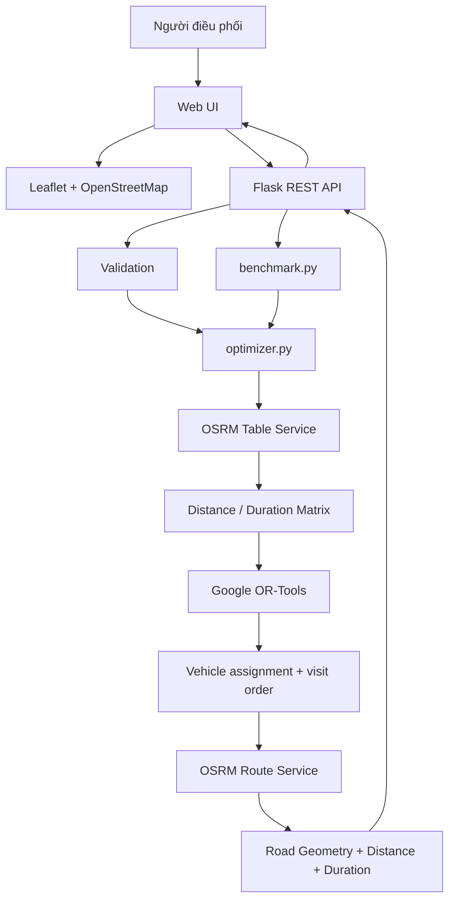
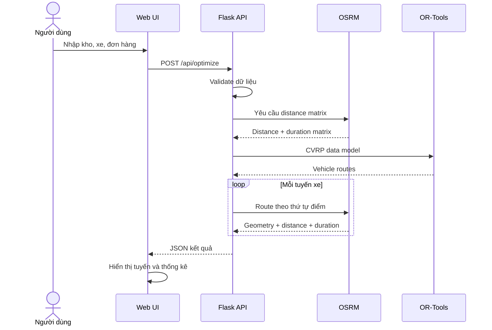

# Kiến trúc hệ thống

## 1. Tổng quan

Hệ thống được chia thành bốn thành phần chính:

1. Giao diện web.
2. Flask backend.
3. Module tối ưu CVRP.
4. Dịch vụ định tuyến OSRM.



## 2. Frontend

Frontend chịu trách nhiệm:

- nhập dữ liệu;
- quản lý danh sách xe;
- quản lý danh sách điểm giao;
- tương tác với bản đồ;
- gọi REST API;
- hiển thị phương án;
- hiển thị benchmark và biểu đồ;
- import/export dữ liệu.

Leaflet được sử dụng để hiển thị OpenStreetMap.

## 3. Flask backend

Flask đóng vai trò trung gian giữa giao diện và phần tối ưu.

Các API chính:

| Endpoint | Method | Chức năng |
|---|---|---|
| `/api/health` | GET | Kiểm tra backend |
| `/api/optimize` | POST | Giải bài toán CVRP |
| `/api/self-test` | GET | Chạy validation test |
| `/api/benchmark` | POST | Chạy benchmark |

## 4. Module tối ưu

`optimizer.py` thực hiện:

- validation bổ sung;
- xây dựng dữ liệu cho OR-Tools;
- tạo RoutingIndexManager;
- tạo RoutingModel;
- khai báo hàm chi phí;
- thêm ràng buộc sức chứa;
- chạy solver;
- chuyển nghiệm thành kết quả ứng dụng;
- tính baseline để so sánh.

## 5. OSRM

OSRM được dùng ở hai giai đoạn.

### Table Service

Tạo ma trận:

```text
distance[i][j]
duration[i][j]
```

giữa kho và các điểm giao.

Ma trận này được dùng làm chi phí cho OR-Tools.

### Route Service

Sau khi OR-Tools quyết định thứ tự:

```text
Kho -> A -> B -> C -> Kho
```

OSRM Route Service trả về geometry theo mạng đường thực tế.

Frontend sau đó vẽ geometry này lên Leaflet.

## 6. Fallback Haversine

Khi không gọi được OSRM, hệ thống có thể sử dụng Haversine:

```text
tọa độ A + tọa độ B
        ↓
khoảng cách địa lý
```

Fallback giúp ứng dụng vẫn có thể chạy thử, nhưng kết quả không phản ánh đầy đủ mạng đường bộ.

## 7. Luồng dữ liệu



## 8. Lý do tách OSRM và OR-Tools

Hai thành phần giải hai bài toán khác nhau:

- **OSRM** trả lời: khoảng cách/thời gian lái xe giữa các tọa độ là bao nhiêu và
  đường thực tế đi qua đâu.
- **OR-Tools** trả lời: nên phân các điểm cho xe nào và nên ghé theo thứ tự nào
  để giảm tổng chi phí dưới ràng buộc sức chứa.

Việc tách hai vai trò này giúp phần tối ưu không phụ thuộc vào cách hiển thị bản
đồ và cho phép thay đổi routing engine trong tương lai mà không phải viết lại
toàn bộ mô hình CVRP.
